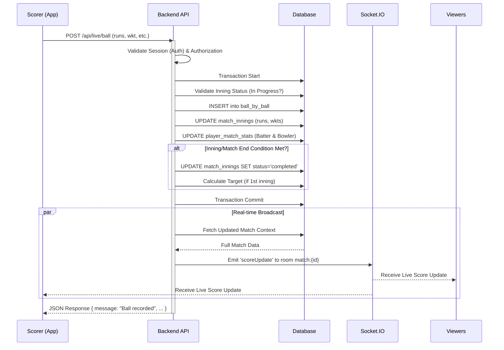

# Cricket League Application Documentation

## 1. API Structure
**Base URL:** `/api`

### **Authentication (`/api/auth`)**
- `POST /register` - Register a new captain
- `POST /login` - Login captain/admin
- `POST /refresh` - Refresh access token
- `POST /logout` - Logout user
- `POST /forgot-password` - Request password reset
- `POST /verify-reset` - Verify reset token
- `POST /reset-password` - Confirm new password
- `PUT /change-password` - Update password (auth required)
- `PUT /change-phone` - Update phone number

### **Matches**
- `GET /api/matches` - List matches
- `POST /api/matches` - Create a match
- `GET /api/matches/:id` - Get match details
- `PUT /api/matches/:id` - Update match
- `POST /api/matches/finalize/:id` - Manually finalize match
- `GET /api/match-summary/:id` - Get match summary
- `GET /api/viewer/scorecard/:match_id` - Public scorecard

### **Live Scoring (`/api/live`)**
- `POST /start-innings` - Start a new innings
- `POST /ball` - Add a ball (core scoring)
- `POST /undo` - Undo last ball
- `POST /batter` - Set new batter
- `POST /end-innings` - Manually end innings
- `GET /:match_id` - Get live match context

### **Teams & Players**
- `GET /api/teams` - List teams
- `POST /api/teams` - Create team
- `GET /api/players` - List players
- `GET /api/player-stats/:id` - Get specific player stats

### **Tournaments**
- `GET /api/tournaments` - List tournaments
- `GET /api/tournament-matches/:tournament_id` - List tournament matches
- `GET /api/tournament-stats/:id` - Tournament specific stats
- `GET /api/tournament-summary` - Team standings/summary

### **Administration (`/api/admin`)**
- `GET /users` - Manage users
- `GET /stats` - System statistics

---

## 2. Response & Error Patterns

### **Success Response Pattern**
All successful API responses follow a standard JSON format, typically returning a 200/201 status code.

```json
// Example: Login Success
{
  "message": "Login successful",
  "token": "eyJhbGciOiJIX...",
  "user": {
    "id": 1,
    "phone_number": "1234567890",
    "email": "user@example.com"
  }
}
```

```json
// Example: Data Retrieval
{
  "data": [ ... ], // or direct object keys
  "meta": { ... }  // Optional pagination info
}
```

### **Error Response Pattern**
Errors return appropriate HTTP status codes (4xx, 5xx) and a JSON object with an `error` key.

```json
// Example: Validation Error (400)
{
  "error": "Password must be at least 8 characters"
}
```

```json
// Example: Unauthorized (401)
{
  "error": "Invalid credentials"
}
```

```json
// Example: Server Error (500)
{
  "error": "Server error",
  "details": "Database connection failed" // (Only in Dev/Debug mode)
}
```

---

## 3. Event Types (Socket.IO)
**Namespace:** `/live-score`

### **Client-to-Server Events**
| Event Name | Payload | Description |
|------------|---------|-------------|
| `subscribe` | `{ matchId: <id> }` | Join the room for real-time updates of a specific match. |
| `unsubscribe`| `{ matchId: <id> }` | Leave the match room. |

### **Server-to-Client Events**
| Event Name | Payload | Description |
|------------|---------|-------------|
| `scoreUpdate` | Match Context Object | Emitted on every ball, undo, or batter change. Contains full match state, current balls, stats, and scores. |
| `inningsEnded` | `{ matchId, inningId }` | Emitted when an innings concludes (10 wickets or overs limit). |
| `subscribed` | `{ matchId }` | Confirmation of successful subscription. |
| `error` | `{ message }` | Sent if an error occurs (e.g., invalid match ID). |

---

## 4. Frontend File Structure

### **Flutter Mobile App (`frontend/lib`)**
```
lib/
├── core/                  # Core utilities, configs, and shared providers
│   ├── api_client.dart    # Centralized API handling
│   └── constants.dart     # App-wide constants
├── features/              # Feature-based architecture
│   ├── auth/              # Authentication (Login, Register, Forgot Password)
│   ├── matches/           # Match Management & Live Scoring
│   │   ├── screens/       # UI Screens (LiveScoring, MatchCreation)
│   │   ├── providers/     # State Management (MatchProvider, LiveMatchProvider)
│   │   └── widgets/       # Match-specific widgets
│   ├── teams/             # Team Management
│   ├── players/           # Player Management
│   └── tournaments/       # Tournament functionalities
├── models/                # Data Models (Match, Player, Team, Inning)
├── screens/               # General screens (Dashboard, Splash)
├── services/              # External services (SocketService)
├── widgets/               # Shared UI Components (CustomButton, InputField)
└── main.dart              # Entry Point
```

### **Admin Panel (`admin-panel/src`)**
```
src/
├── components/            # Reusable UI Components
│   ├── Layout/            # Sidebar, Header
│   └── Shared/            # Buttons, Modals, Forms
├── pages/                 # Page Views
│   ├── Dashboard.jsx
│   ├── Users.jsx
│   ├── Teams.jsx
│   └── Login.jsx
├── services/              # API Services
│   ├── api.js             # Axios instance & endpoints
│   └── auth.js            # Auth service helpers
├── utils/                 # Helper functions
│   └── formatters.js
├── App.js                 # Main Router & Layout
└── index.js               # React Entry Component
```

---

## 5. UML Sequence Diagram: Live Scoring Process

The following diagram illustrates the flow when a scorer adds a ball to a live match.


