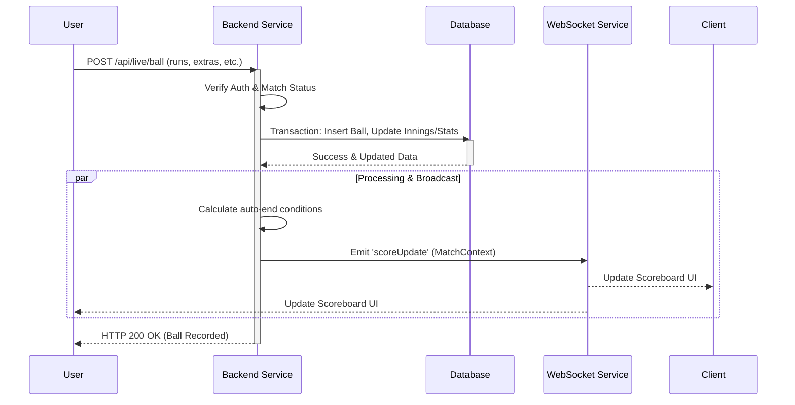
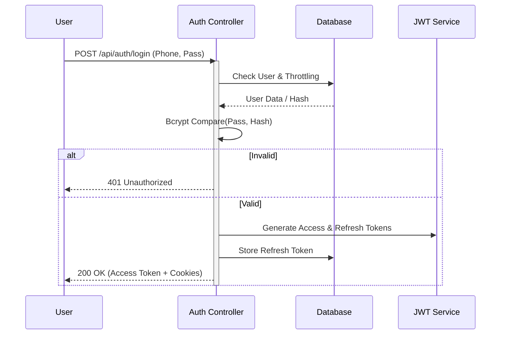
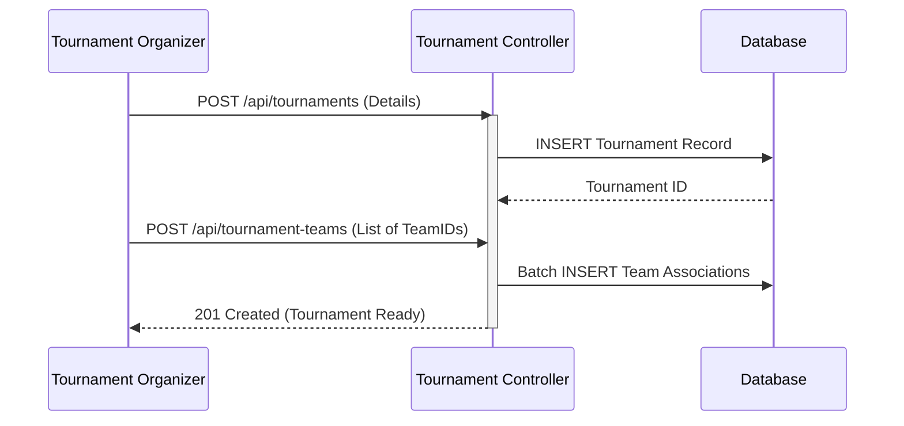
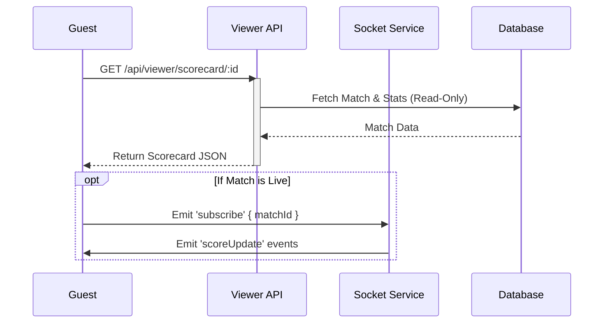

# 1.4 System Features

## 1.4.1 System Feature: Live Ball-by-Ball Scoring
- **Description:** Real-time scoring interface allowing authorized scorers to record every delivery of a cricket match, including runs, wickets, extras, and player swaps.
- **Priority:** High
- **Inputs:** 
  - Match context (Match ID, Inning ID)
  - Delivery details (Runs scored, Extras type, Wicket details)
  - Player changes (New Batter, New Bowler)
- **Processing:** 
  - Authenticate scorer permissions.
  - Validate delivery (e.g., ensure bowler isn't bowling consecutive overs, ball counts are legal).
  - Update atomic match state (runs, wickets, overs).
  - Calculate derived statistics (Economy rates, Strike rates, Partnership).
  - Check for auto-end conditions (10 wickets, Max overs, Target chased).
  - Broadcast update event to all connected clients.
- **Outputs:** 
  - Updated persistent database records (Balls, Innings, Player Stats).
  - Real-time WebSocket event `scoreUpdate` with full match context.
  - Visual feedback to Scorer (Toast message, Scoreboard update).

### 1.4.2 Behavioral Diagram (Live Scoring)

---

## 1.4.3 System Feature: User Authentication & Security
- **Description:** robust authentication system for Captains (Users) and Admins using mobile numbers or email, secured with JWT and HTTP-only cookies.
- **Priority:** High
- **Inputs:** 
  - Credentials (Phone Number/Email, Password)
  - Client Type (Web/Mobile)
- **Processing:** 
  - Rate limit requests to prevent brute force.
  - Verify credentials against hashed passwords (Bcrypt).
  - Generate Access Token (Short-lived) and Refresh Token (Long-lived).
  - Store Refresh Token in HTTP-only secure cookie (Web) or Body (Mobile).
- **Outputs:** 
  - Authenticated Session.
  - User Role & Permissions (Scopes).
  - CSRF Token for session protection.

### 1.4.4 Behavioral Diagram (Login Flow)

---

## 1.4.5 System Feature: Tournament Management
- **Description:** Comprehensive management of cricket tournaments, including creating tournaments, adding teams, scheduling matches, and tracking tournament-wide statistics.
- **Priority:** Medium
- **Inputs:** 
  - Tournament Details (Name, Logo, Dates, Overs info)
  - Participating Teams List
- **Processing:** 
  - Validate unique tournament attributes.
  - Associate selected teams with the tournament.
  - Initialize tournament standings/points table.
  - Aggregate statistics from completed tournament matches.
- **Outputs:** 
  - Tournament Dashboard.
  - Points Table (Standings).
  - Top Stats (Most Runs, Most Wickets).

### 1.4.6 Behavioral Diagram (Tournament Setup)

---

## 1.4.7 System Feature: Public Scorecard Viewing
- **Description:** Publicly accessible interface for viewing detailed scorecards of finished matches and following live matches without requiring a login.
- **Priority:** Medium
- **Inputs:** 
  - Match ID (via URL parameter)
- **Processing:** 
  - Retrieve match data, innings details, and player stats.
  - Filter out private/admin-only fields (e.g., contact info).
  - Establish WebSocket connection for live updates (if match is live).
- **Outputs:** 
  - Rendered Scorecard UI.
  - Live Ball-by-Ball feed.

### 1.4.8 Behavioral Diagram (Public Access)

